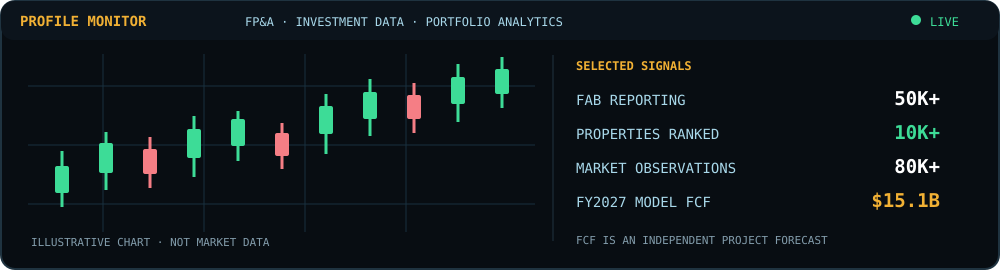

 

## About

I’m a financial analyst working across **banking FP&A, financial reporting, and investment data analysis**. At HDPM Magical Infotech, I supported First Abu Dhabi Bank’s planning and management reporting; at AGI Beacon, I worked with real estate investment data; and at Circa, I support billing, receivables, and cash reporting.

I use finance systems and data tools to turn messy records into useful reporting: **50K+ banking records validated**, **10K+ properties ranked**, and a **six-year Walmart FP&A model** built as an independent project.

## What I Do

<table>
<tr>
<td width="33%" valign="top">

### 📊 FP&A and Banking
AOP and Latest Estimate inputs, budget-to-actual analysis, management reporting, legal-entity reconciliations, and shared-cost allocations.

</td>
<td width="33%" valign="top">

### 💹 Investment Data
Property screening, financial indicators, scoring frameworks, and comparative analysis for acquisition review.

</td>
<td width="33%" valign="top">

### 📈 Portfolio Analytics
Performance, benchmark, risk, scenario, and stress analysis across ETF and market data.

</td>
</tr>
</table>

The candlestick chart is illustrative. The FY2027 free cash flow figure is an independent Walmart model forecast.

## Featured Projects

### 🧾 Walmart Strategic FP&A and Financial Performance Model

A **15-tab, six-year** driver-based model across Walmart U.S., International, and Sam’s Club. It forecasts **$740.6B net sales, $34.5B operating income, and $15.1B free cash flow for FY2027** and includes three scenarios, 56 sensitivities, and an 11-line quarterly FP&A review framework. These figures are my model outputs.

**[View Walmart project repository →](https://github.com/ChetanBhangare/Walmart-Strategic-FPA-Model)**

### 📈 PortfolioIQ — Cloud Investment Analytics

A platform for comparing ETF and asset performance using **80K+ observations** from **10+ years** of daily market data across **30+ ETFs and assets**. Five analysis modules cover performance attribution, risk, benchmarks, scenarios, and stress testing.

**[View PortfolioIQ repository →](https://github.com/ChetanBhangare/PortfolioIQ)**

## Experience Snapshot

| Role | Organization | Dates | Focus |
|---|---|---|---|
| FP&A & Billing Analyst | **Circa** | Jun 2026 – Present | A/R and cash reporting for 100+ customer accounts; milestone billing and MySQL-backed job reporting |
| Financial Analyst | **AGI Beacon** | Jun 2025 – May 2026 | 50K+ real estate records; property indicators and acquisition screening |
| Financial Analyst, FAB client | **HDPM Magical Infotech** | Sep 2021 – May 2024 | AOP/Latest Estimate support, intercompany reconciliation, and banking P&L analysis |

## Tools

**Finance and reporting**  
      
Hyperion HFM · Essbase

**Analytics and data**  
    

## Education

- **M.S. in Financial Technology** — Worcester Polytechnic Institute, 2026
- **Postgraduate Diploma in Cyber Security** — Tilak Maharashtra Vidyapeeth, 2024
- **BBA in Computer Applications** — Pune University, 2021

## Certifications and Simulations

- Bloomberg Market Concepts
- J.P. Morgan Investment Banking Simulation — Forage
- Goldman Sachs Controllers Simulation — Forage
