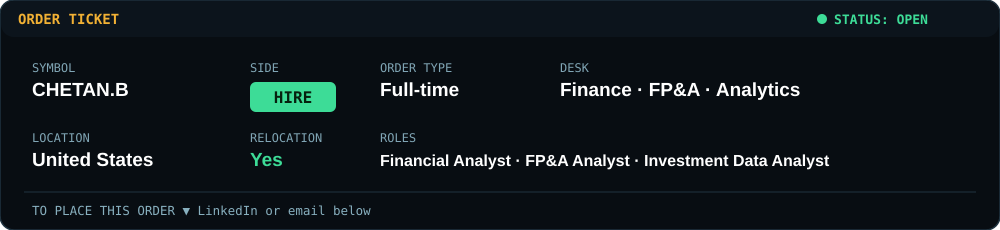
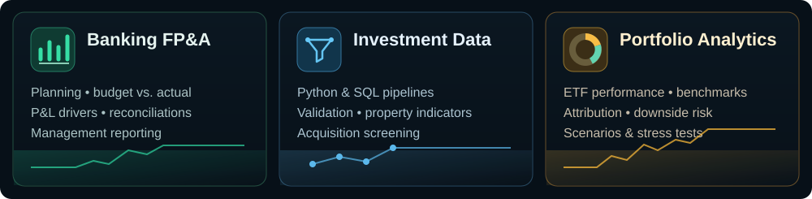

 

 

## About

I’m a financial analyst focused on **banking FP&A, management reporting, and investment data analysis**. At HDPM Magical Infotech, I supported First Abu Dhabi Bank’s AOP and Latest Estimate reporting. At AGI Beacon, I worked with real estate data for acquisition screening. I currently support billing, receivables, and cash reporting at Circa.

I enjoy connecting financial questions with reliable data, clear models, and useful reporting. My work spans **50K+ banking records**, a framework ranking **10K+ properties**, and a six-year Walmart FP&A model built as an independent project.

## What I Do

The chart is illustrative, not live market data. FY2027 Walmart figures below are independent model forecasts, not company guidance.

## Featured Projects

| Project | Focus | At a glance |
|:---|:---|:---|
| 🧾 **[Walmart Strategic FP&A Model](https://github.com/ChetanBhangare/Walmart-Strategic-FPA-Model)** | Forecasting · corporate FP&A | 15-tab, six-year driver model; FY2027 forecast of **$740.6B sales** and **$15.1B FCF**; three scenarios and 56 sensitivity outcomes. |
| 📈 **[PortfolioIQ](https://github.com/ChetanBhangare/PortfolioIQ)** | Investment analytics · data platform | **80K+ observations** across **30+ ETFs and assets**; performance, risk, benchmarks, scenarios, and stress testing. |
| 🧮 **[Omega Portfolio Analytics](https://github.com/ChetanBhangare/Omega-Based-Portfolio-Optimization-Risk-Analytics-Platform-)** | Portfolio optimization · downside risk | Prototype comparing allocations with the Omega ratio across **11 return thresholds**; uses **simulated price data**. |
| 🤖 **[FinRL Portfolio Research](https://github.com/ChetanBhangare/Portfolio-Optimization-Algorithmic-Trading-using-Deep-Reinforcement-Learning-FinRL-)** | Quant research · backtesting | Research pipeline for **five trading agents**, with mean-variance and market-index comparisons. |

## Tools

## Experience Snapshot

| Role | Organization | Dates | Focus |
|---|---|---|---|
| FP&A & Billing Analyst | **Circa** | Jun 2026 – Present | A/R, cash reporting, milestone billing, and project-level finance workflows |
| Financial Analyst | **AGI Beacon** | Jun 2025 – May 2026 | Real estate data quality, property indicators, and investment screening |
| Financial Analyst · FAB client | **HDPM Magical Infotech** | Sep 2021 – May 2024 | Banking FP&A, multi-entity reporting, reconciliations, and AOP/LE cycles |

## Education

- **M.S. Financial Technology** — Worcester Polytechnic Institute, 2026
- **Postgraduate Diploma, Cyber Security** — Tilak Maharashtra Vidyapeeth, 2024
- **BBA, Computer Applications** — Pune University, 2021

## Certifications and Simulations

| Logo | Credential | Provider |
|:---:|:---|:---|
|  | **Bloomberg Market Concepts** | Bloomberg |
|  | **Investment Banking Job Simulation** | J.P. Morgan · Forage |
|  | **Controllers Job Simulation** | Goldman Sachs · Forage |

**Open to full-time Financial Analyst, FP&A Analyst, and Investment Data Analyst opportunities in the United States.**

[LinkedIn](https://www.linkedin.com/in/chetanbhangare-ai-ml/) · [Email](mailto:cbhangare@wpi.edu)

